# factorio_tricks_iceberg
speedrun tricks and notes about Factorio 

Based on the [thread](https://discord.com/channels/260103071017730048/1435625958576226405) of the same title in the [Steel Axe discord](https://discord.gg/AntiElitz)

The save file found in [saves/Factorio_Tricks.zip](saves/Factorio_Tricks.zip) has some of the examples listed below along with various useful blueprints available. The mods that are used in the save file are ones that have generally been found useful to plan runs, please read about them on the mod portal or feel free to ask about them in the Steel Axe discord.

- Blueprint to logi request
- Z to drop single items (hotkey `Z`) (Z-drop)
  - spamming `Z` on belts to drop items faster
  - 
- Combinations of control and left / right click for all inventory or held stack
- Inserter dragging over entities
- Standard 
- Double bindings of keybinds
  - extremely useful for double rotate in 1.1 before they added flip keybinds 
- Standard layouts (common furnace stack, green chip build, labs, mall)
  - standard furnace stack
    - [clip of AntiElitz Default Settings 7:31:00 building it at 21:50](https://www.youtube.com/watch?v=nVfgJjem_wkt=1310)
      - Note: chests are used as early game replacements for future undergrounds for fuel belts
    - 
      - Also note that you can partially upgrade the input and output to reduce material cost like this:
      - 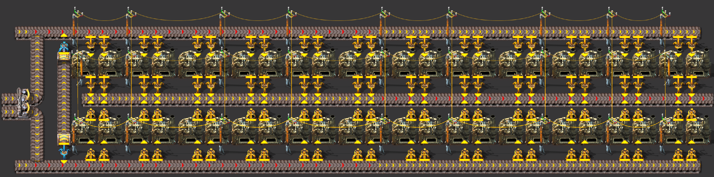
      - or like this with yellow undergrounds instead:
      - 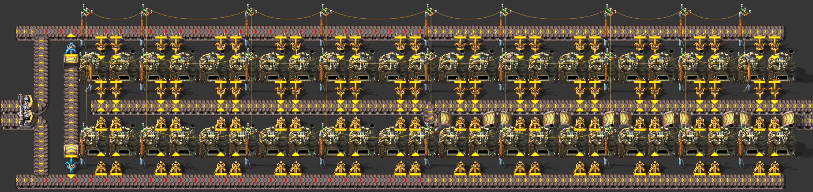
  - standard steel furnace stack
    - when placing steel, drag the inserters for fueling furances making steel all facing towards the furnace as one long lane. This is very fast to do and you flip when placing other inserters down
    - [clip of AntiElitz Default Settings 7:31:00 building it at 51:28](https://www.youtube.com/watch?v=nVfgJjem_wkt=3088)
    - 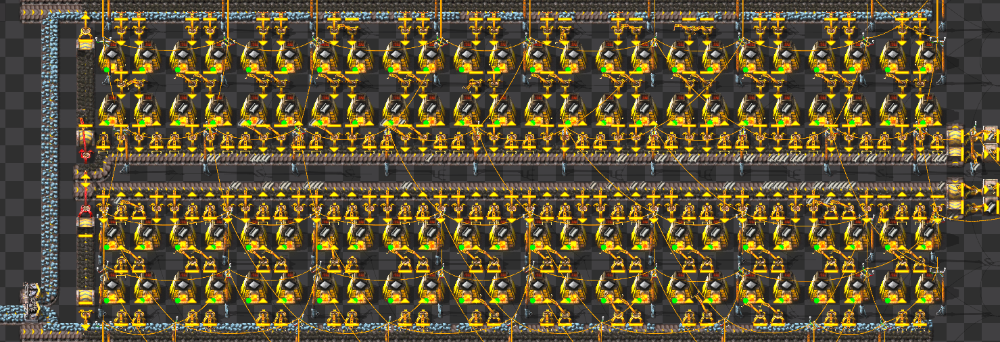
    - partial upgrade works for steel as well, but since slow to produce, don't need to deal with output on this stack build:
    - 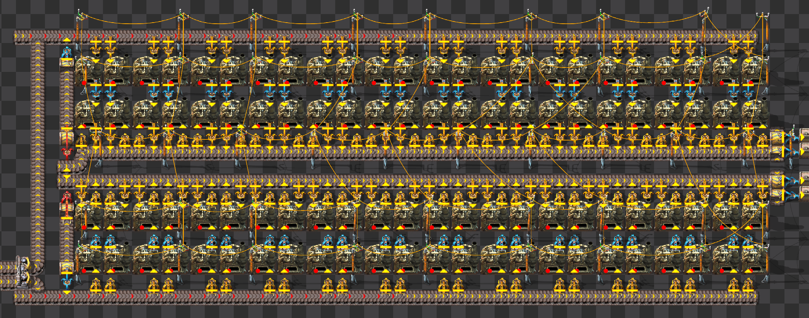
  - standard green chip build
    - double yellow inserter allows the assembler 1 to make copper wire at 6/7 of its maximum rate. With fast inserter it is able to run at its max rate.
      - 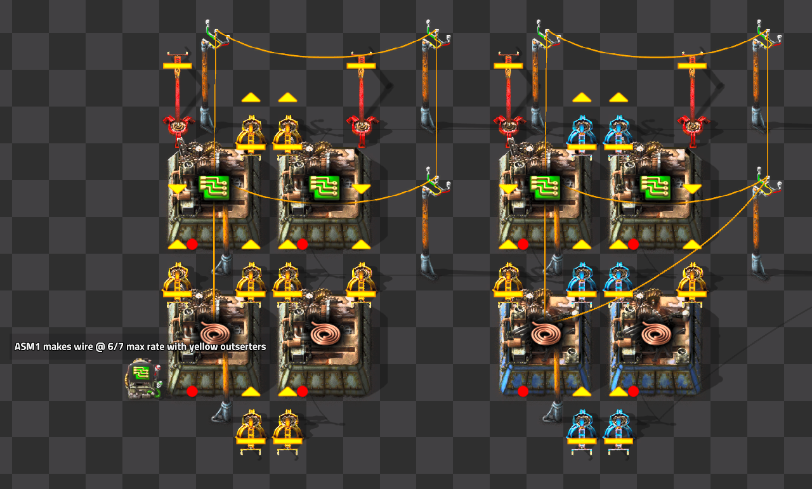
    - this is the standard full green chip build setup to produce two 
      - 
    - this variant is faster to setup since it has straight belt drags and only one inserter types.
      - 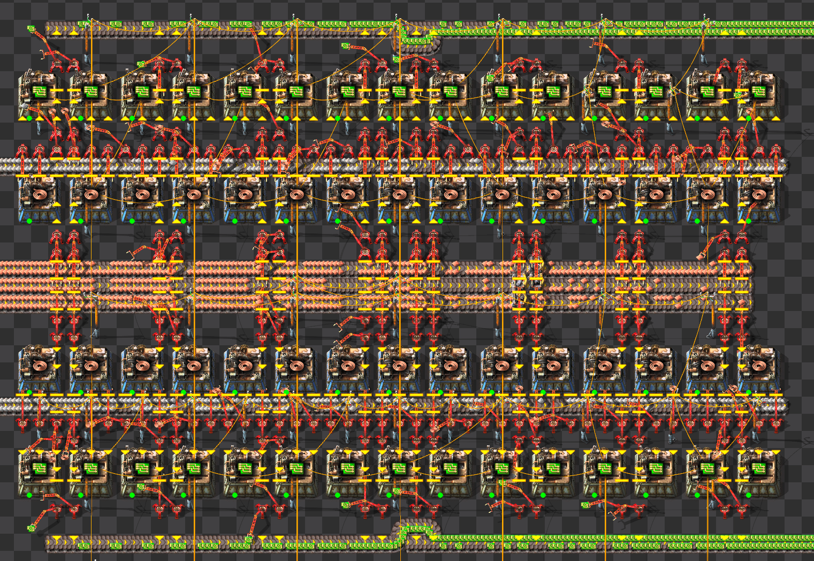
- Integer overflow
- Double readings of circuits
- Filter order dependant on item id
- Dropping stuff on ground and building over it
- Using item production as counters / limiters for other assemblers in very weird mall setups (like using assemblers in chest and taking them out as a signal, new 100p design)

- Fast replace of belt with splitters or undergounds
  - [Mazmot's trick](https://discord.com/channels/260103071017730048/1435625958576226405/1435649420594122813)
  - Issue: Misplace belt -> have to mine whole belt to fix it (mining 1 entity per tile)
    - Two potentially faster options:
    - Replace with underground, then mine. 2 entities mined per 6 tiles. Usually doesn't save you time unless you mess up a lot of belts, but is nice in those situatiosn
      - Replace belt with a line of splitters, then fast replace the splitters with a belt 1 tile over.
        - needs good precision
        - only works for shifting 1 tile (but that's the most common mistake)
        - needs a dozen or so splitters to be worth it

- Prerotate with entities that dont have a rotation
- Belt prio of closer side
  - In combi with that: mixed mining
- Walking around the corner on a belt is only faster than the diagonal at blue belt and above
- Counting items with burner inserters
- Logic requests multiplier (which also goes under 1x meaning you can use 0.1 to request 20 science packs into a requester chest instead of a full stack)
- Storage of item in recipe changed assembler (manual and auto). when you manually change the recipe and assign it back you can amass extreme item counts. i can attest to it working to at least half a million steel)
- Liquid ouput goes into input when recipe changed and same liquid
- Pumpthrough with chemplant (to turn a fully full pipe) outdated with 2.0
- Speed modules being sometimes better for quality module utilization. as in: very high quality quality module and one speed module being used resulting in higher utilization of said qmod.
- Pppppp (Pantabo's Performant Power Pole Placement Plan) or blipi (Belt Lock Interrupt Placement Interpolation)
  - belt lock 
  - must click and hold on belt as if you are going to drag it, bring cursor out of range, switch entities to what you want to place and then back to original belt. The game will place new entities between where you started to drag belts to where your cursor is, until it is out of range to place the new entity. you switch back to  the belt to have your movement make your cursor attach to the new position of the new belt position so you can place the next row or column of entities. In the example video, a belt is selected and the new entity is yellow inserter or power poles depending on the row, the furnaces are already placed to prevent new entities from being placed in those positions. The upgrade planner is used to prevent placing belts in the empty gaps.
  - [clip](https://discord.com/channels/260103071017730048/260103071017730048/1399409772633260032)
  - [AntiElitz Explaining it](https://www.twitch.tv/videos/2156553379) also \!pppppp or \!blipi in the discord linked above
- Quality filter for nutrients
- Higher tier items not being used as often
- Auto crafter
- Using raw ingedients to then craft stuff on the space ship.
- mixed rockets
- Common targets in early game
- Scaling fast and balance of mall / Production / science 

- underground belt sideloading

- Using accumulators for speed control
- Speed change of inserters depening on target / giver
- Mixed smelting
- Smoothie pipes
  - 
- dragging the flag in a blueprint

- poledancing or poledrag 
  - performed by holding down LMB to drag a power pole, switch to inserter, and then switch back power pole.
  - In 1.1 this was about 14 frames to swap between the two hotkeys, [in 1.1 Anti had power pole bound to RMB](https://www.youtube.com/watch?v=97EaNC_NftA&t=607s) so he could drag with one extra key and have the double binding help him.
  - In 2.0 it's MUCH more precise and is largely not considered worthwhile to perform. This is because it changed to about 7 frames and it now ignroes the first tile you move holding the LMB so it feels extra awkward. [Antipatience explanation](https://discord.com/channels/260103071017730048/260103071017730048/1400352750839009290)
  - [clip](https://www.youtube.com/watch?v=LDg2hQjODmk)
- hogan hook (hooker) and paperclip
  - paperclip performed by drawing a paperclip shape a half stack will look like a letter `U`, `C`, `J` depending on orientation.
  - the hook is then performed by using a flip or double rotate in the middle to place the lane next to you.
  - [clip](https://www.twitch.tv/zaspar_/clip/TacitEphemeralNuggetsChefFrank-QCtG5Hzet-gSjLif) of Zaspar performing hook
  - 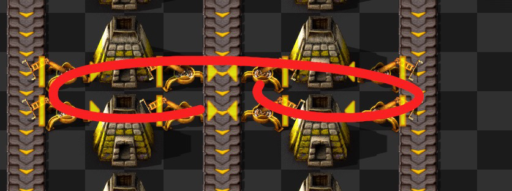
- smart belt turn off (with pipette and place)
- pick placing or Q placing (hotkey `q`)

- Recyclers adding to total production count (discovered by the bestest, brightest, most competent speedrunner known as pantabo1). useful for gc achievment -> craft gc in emp, put those into combinator assembler, then into a recycler that goes back into the assembler. reason for being useful despite no productivity bonus: low additional cost of copper wire in addition to the gc. saves recyclers and there was another few reasons which i dont remember.
- zippering from Zaspar's TAS
- bot queue management
- Using achievment for early warning of attack
- Decon planner specifics in general: ghost types, fruits, items etc
- land mine spam
- wall ship
- Thruster stacking: you can put another row of thrusters behind already existing ones when you go more than 100 (?) tiles behind them. useful because of extra speed without added width which would otherwise slow you down.
- Manual wiring of power poles, especially to isolate power networks, like in the old 100% power plant for pumps, and Aquilo for the water bootstrap
- Quality ice: uncommon ice from fulgora or from space dropped to aquilo to craft uncommon cryo science to save one rocket.
- Trees on vulcanus for achievment
- Nukes for cliffs
- moving the storage chest for faster bot beacon decon
- Cars to bridge lava. cars hitbox in general -> can put the car essentially on top of inserters. can allow for stupid setups (look up antis fulgora island design)
- Construction belt
- using boilers to filter fuel from mixed lanes 
- prerotate in general
- inventory compressing with handrafting
- fast feeding personal asm with craftingqueue canceling
- quality speedmodules cutting energy comsumption
- filtering of chests with middle mouse
- inserting modules into beacons with inserters (and taking them out) can be used to not have to remember to upgrade plan them (may or may not have been used in 100p runs by nefrums? most likely not)
- Tank requester chests: tanks have logistic request slots. can theoretically be used as requester chests
- Compressors >>> balancers
  - compressor blueprint book in save game and in discord by \!compressorbp
  - 
- Landfill in blueprints for outlines and guidelines
- impact of low power on UPS
- Snap to grid for big base alignment 
- power alarm
- impact of changing RAM clock speed on UPS
- pumpless advanced oil setups
- 100+% productivity exploit: reassign a recipe after getting the prod bonus but before the items are consumed
- Positive feedback loop of plastic auality with lds and recycling lds.
- Using artillery in space to shoot asteroids
  - After like 80 levels of artillery speed and damage, and like 100 artillery with multiple shells each, you can kill a huge asteroid at like 10km/s (From [GlassBricks](https://discord.com/channels/260103071017730048/1435625958576226405/1435632309083705424))
  - can't quite skip railgun yet with it
- Map manipulation; moisture area and dark spots etc
- Aquilo map gen beinh rotational
- P2P trains with only normal rail signals
- Circle station
- Silo chest
- spawn ship chest
- Using red belt for lowered belt delay (as opposed to higher throughput)
- Belt corners being faster
- inserter chain instean of belt

- how to enable grid/more hotkey rows/alt mode/disable subgroups/flat inventory etc
- how to disable decoratives

- Color shading for better visibility
 
- Hotkeys and why they (kind of) dont matter
 
- Shooting shipwreck parts in tas
- Mining progress being kept
 
- replays how to enable them and use them 
 
- how to setup several instances
 
- setup shared savegames
 
- The rest settings - ctrl + alt + click on settings in the menu
 
- Reducing explosions and gun sounds
 
- change preview chunks
 
- unsorting your inventory for more flexibility, very advanced strat
- 1:1 monitor for max visiblility
- Stellar parallax alignment

- The scaling difficulties in factorio: [you cant just build bigger](https://discord.com/channels/260103071017730048/1435625958576226405/1435642406006558881)
  - Going twice as fast requires building twice as much in half the time, so 4 times the building speed
  - The quadratic scaling law

- Micro gaps in belt to allow for sideloading

- [Sushi builds that don't use any circuitry](https://discord.com/channels/260103071017730048/1435625958576226405/1435644090963460346)
- Train tracks vs belt
- Worm dancing or worm wiggle
  - hold `A`/`W` and tap `D`/`S` to wiggle between the two directions. Since spitters target where you are going and not where you are, you will be prevented taking hits from spitters while taking on the biter nests 
- Stacking guns in your gun slots
- 400k steel in one assembler
- Fluid void by recipe change
- skipping the cutscene
- Gravitational pull at halfway point and oddity with the target changing this behavior
- Space platform hub only being sorted when you look at it (causes inserters to grab items in different order from hub if you have looked or not)
- Deconstruction of stuff on space platform voiding it

- Building large basic oil and only doing advanced for lubricant/rocket fuel, skipping cracking
- segmenting your nuclear power plant to mitigate the effects of adding nuclear reactors causing dramatic temperature drops.

- Circuitry being usable via imported blueprint without unlocking circuit network
- research construction bots before you'll get entity ghosts for destroyed entities (biters, Anti running into them with a car, etc)
- shift click for fast research queuing
- the various ways of killing trees instead of mining them
- limit production rate by inserter amout/inserter capacity limiting
- lab chaining/boiler chaining
- landfilling offshore pumps
- Zig zag belts for shorter belt delay

- car belts

- Double reach when placing belts
  - [clip](https://discord.com/channels/260103071017730048/1435625958576226405/1435654333898293332)
- placing inserters inside stationary cargo wagons
  - [clip](https://discord.com/channels/260103071017730048/1435625958576226405/1435652850398003271)

## Combat Tips
- Eat Food to heal! Put on hotbar and use them to eat them.
  - Get fish from lake, RMB to "mine" them up like when you mine ore. Can also have inserters fish for you.
  - Eat Jellynut (brains/green fruit) for a 150% movement speed boost. 
- Melee attacking
  - unequip ammo or otherwise attempt to shoot without ammo, useful early on
- turret creep or how to push with turrets, place a few turrets downs and Z-drop (single item drop) ammo into them
  - clip from Nefrums Default Settings 8:29:44 [turret creep example at 47:24](https://www.youtube.com/watch?v=ddEQPtxl7MY&t=2843s)
- place stone furnaces and pipes to protect structures since they are cheap to build and protect more expensive structures
- blocking nest spawns with pipe
  - 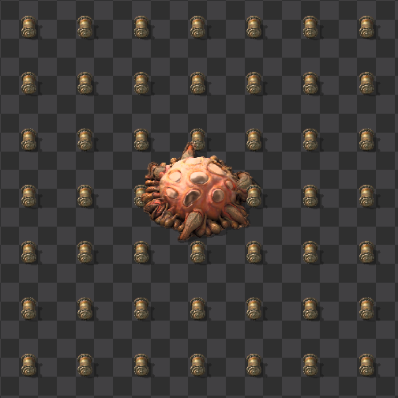
- use turrets with target filtering set to make your life easy
  - 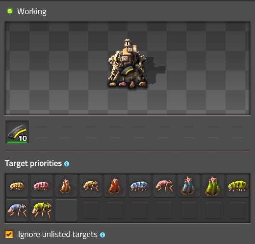
- demolisher baiting to destroy cliffs
- vulcanus demolisher/worm strats
  - poison capsule only
    - AntiElitz Default Settings 8:24:39, [demolisher poison capsule only example at 6:01:14](https://www.youtube.com/watch?v=izWmchnJGSE&t=21674s)
  - turret pulling (energy shield for extra safety)
    - Nefrums Default Settings 8:29:44, [demolisher poison capsule + turrets example at 5:18:10](https://www.youtube.com/watch?v=ddEQPtxl7MY&t=19089s)
- abusing biter pathfinding with wall funnels
- offensive land mines
- discharge defense for segmented enemies

### Combat adjacent 
- pollution & chunk mechanics
  - manipulating biter expansion by placing entities in unclaimed chunks (more useful for Death World challenges).
  - great [video explaining this (at 4:40)](https://www.youtube.com/watch?v=SPfP9LN1o8o&t=280s) by Michael Hendriks
- nuking landfill for increased pollution absorption

- thruster underfueling for better fuel efficiency
- building rail while driving locomotive
- crafting queue black hole storage
- /permissions to disable handcrafting for lazy bastard
  - can also unset the hotkey
- car driving mode in controls settings

- tips and tricks has lots of good information
  - 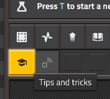
- as does Factoriopedia
  - 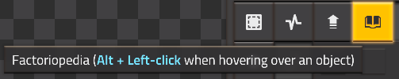
- `e` will confirm the window you are on, useful to quickly accept recipe or set filters or many other things. very useful for "Default Settings" speedruns
  - 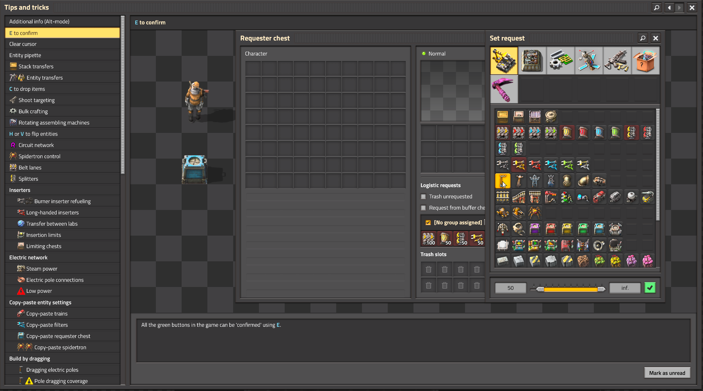
- press \` to open the chat (and Lua console) to enter a command by default
- in multiplayer can use `[armor=name]` where name is the player in the chat (press \` to open the chat to enter a command by default)
- in multiplayer can use `/open name` where name is the player in the chat
- Dropping things into another player’s inventory, treat players like a chest! (latency can make it finicky)
- `/editor` or `Ctrl + shift + F11`
- `Ctrl + Shift + E` to open prototype explorer to see what is your current game.
  - will open browser to relevant pages in the wiki as needed
- `Ctrl + Shift + F` to open prototype page of entity you are hovering over with your mouse.
  - Can see how much heat something consumes on Aquilo this way!
  - will open browser to relevant pages in the wiki as needed

- [autocrafter circuitry explanation](https://www.twitch.tv/videos/2613056573)

- schrodinger circuits with space hub, it sorts items when you open item causing inserters to grab different items depending on whether you have opened the ship hub or not

- inserter item throughput and base handsize
  - yellow is 5/6 (0.8333333333) items/s (handsize 1)
  - red is 1.2 items/s (handsize 1)
  - blue is 2.4 items/s (handsize 1)
  - bulk (green) is 2.4 items/s (handsize 2)
  - stack (white) is 2.4 items/s (handsize 6)

- disable multi undo
  - 

- https://www.reddit.com/r/factorio/comments/1oucpvl/psa_you_can_get_33_more_science_for_free_by/

- not speedrun oriented, but a generically useful new player focused video can be found [here](https://youtu.be/E7ShDWXvD4M?si=eOPzi3Ld4NxOTDuR)
