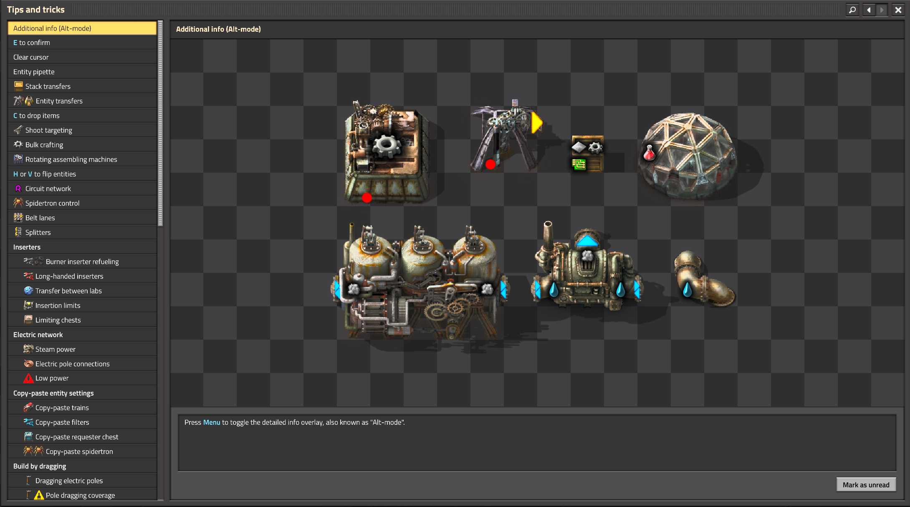
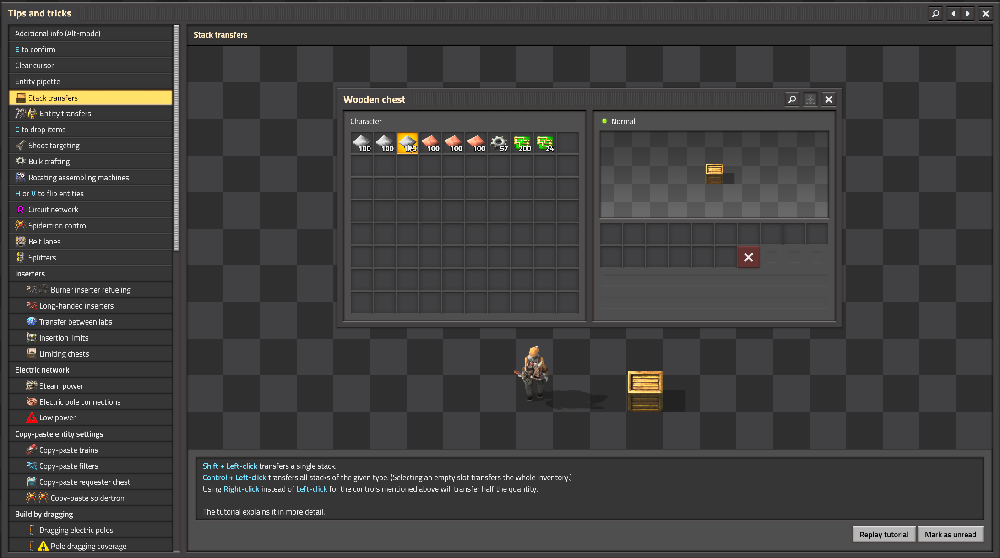
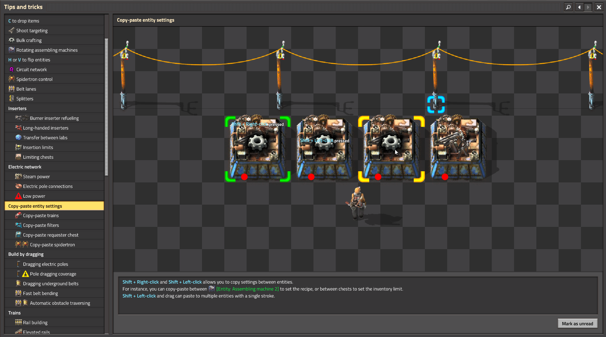
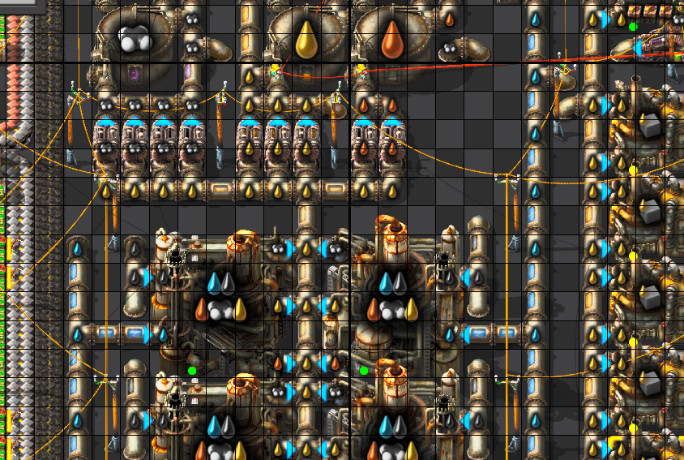
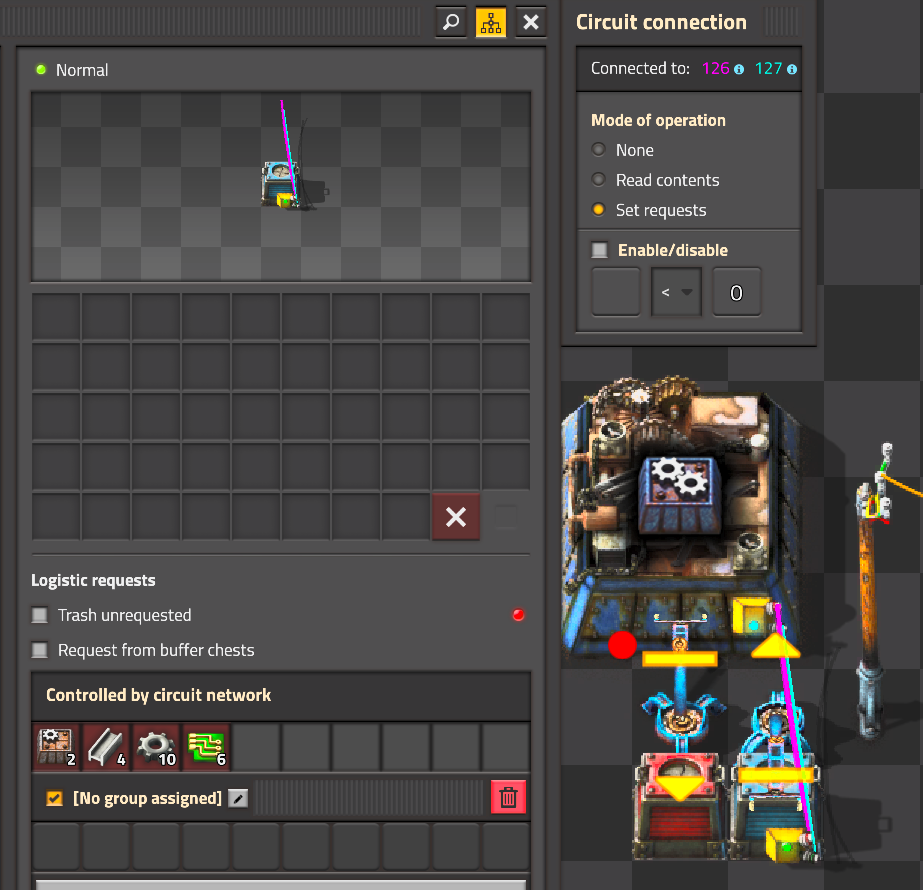
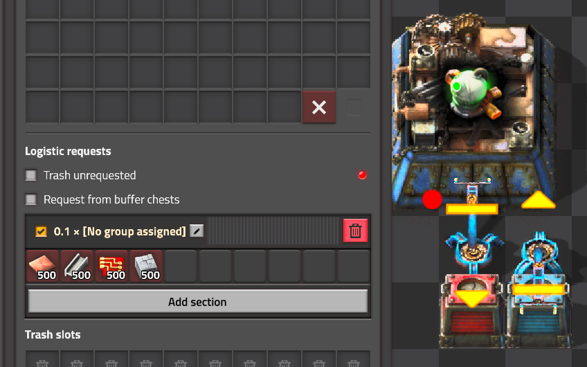
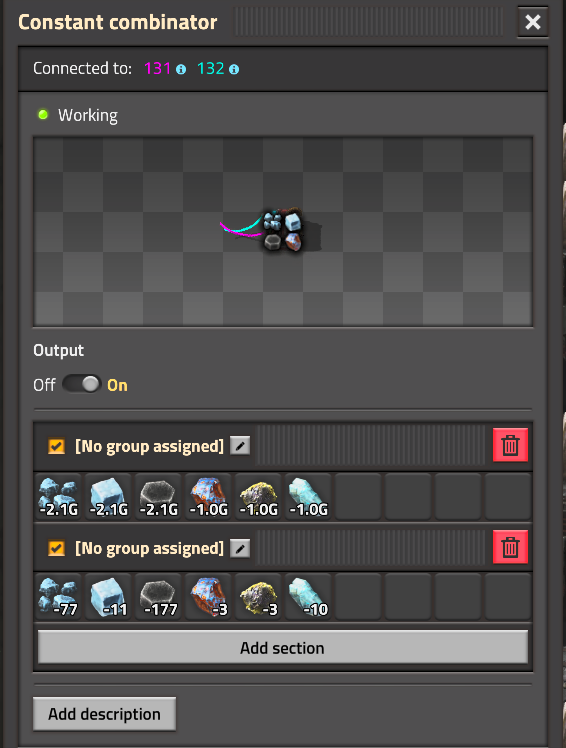

# factorio_tricks_iceberg
speedrun tricks and notes about Factorio 

Based on the [thread](https://discord.com/channels/260103071017730048/1435625958576226405) of the same title in the [Steel Axe discord](https://discord.gg/AntiElitz)

The save file is available in the release files on GitHub `Factorio_Tricks.zip`. It has some of the examples listed below along with various useful blueprints available.  

The mods that are used in the save file are ones that have generally been found useful to plan runs, please read about them on the mod portal or feel free to ask about them in the Steel Axe discord.

The blueprint book is also available [Factorio_Iceberg_Blueprint_Book.txt](./Factorio_Iceberg_Blueprint_Book.txt)

# useful controls/hotkeys/menus/settings
- Z to drop single items (hotkey `Z`) (Z-drop)
  - spamming `Z` on belts to drop items faster
  - 
- Alt mode
  - 
- Combinations of control and left / right click for all inventory or held stack
  - 
- Inserter dragging over entities
- Double bindings of keybinds
  - recommend to double bind `Enter/leave vehicle` with the hot key for the vehicle that way you can double tap it to place and enter quickly since 2.0 automatically fuels your vehicle from inventory you can just go!
  - extremely useful for double rotate in 1.1 before they added flip keybinds
- shift + right click to copy, shift + left click to paste entity settings
  - this works for all entities, filters, splitters, etc.
  - 
- Hotkeys and why they (kind of) dont matter
  - some people spend a lot of time rebinding hotkeys (AntiElitz), others just play on purely default keybinds (Derek). Play in whatever way you are comfortable with. It's more important to get experience than to worry about this stuff most of the time.
- tips and tricks has lots of good information
  - 
- as does Factoriopedia
  - 
- `e` will confirm the window you are on, useful to quickly accept recipe or set filters or many other things. very useful for "Default Settings" speedruns
  - 
- press \` to open the chat (and Lua console) to enter a command by default
- in multiplayer can use `[armor=name]` where name is the player in the chat (press \` to open the chat to enter a command by default)
- in multiplayer can use `/open name` where name is the player in the chat
- Dropping things into another player’s inventory, treat players like a chest! (latency can make it finicky)
- `/editor` or `Ctrl + shift + F11`
- `Ctrl + Shift + E` to open prototype explorer to see what is your current game.
  - will open browser to relevant pages in the wiki as needed
- `Ctrl + Shift + F` to open prototype page of entity you are hovering over with your mouse.
  - Can see how much heat something consumes on Aquilo this way!
  - will open browser to relevant pages in the wiki as needed
- shift left click for fast research queuing
- disable multi undo
  - 
- pick placing or Q placing or pippete placing (hotkey `q`)
- smart belt turn off (with pipette and place, more useful in 1.1)
- replays how to enable them and use them  
- how to setup several instances
- resetting achievements (using multiple instances to keep steam achievements)
- setup shared savegames
- The rest settings - ctrl + alt + left click on settings in the menu
- Reducing explosions and gun sounds
- change preview chunks
- unsorting your inventory for more flexibility, very advanced strat
- Map manipulation; moisture area and dark spots etc
- Aquilo map gen being rotational
- how to enable grid/more hotkey rows/alt mode/disable subgroups/flat inventory etc
- how to disable decoratives
- Color shading for better visibility
- 1:1 monitor for max visiblility
- /permissions to disable handcrafting for lazy bastard
  - can also unset the hotkey
- car driving mode in controls settings

# Guides
- How to stream Factorio, setup OBS [How to stream Factorio](https://www.youtube.com/watch?v=bsfmgXaw1SQ)
- Factorio 2.0 (and Space Age) Guides
  - RSNG+ Speedrun Guide for 2.0 Space Age [RSNG+ Speedrun Guide Space Age](https://docs.google.com/presentation/d/1LxBz_OzHweOGSpxfq_P0Q06UkK9GzvkGe9rki07H_8E/edit?usp=sharing)
- Factorio 1.1 Guides
  - Any% Speedrun Guide for 1.1 updated by Phredward [Any% Speedrun Guide 1.1 Updated](https://docs.google.com/presentation/d/1qnbjaTK_Ah-Sp1YI2hBwgYMv78WSvXLuCBds9Z0NZT8/edit?usp=sharing)
    - Any% Speedrun Guide for 1.1 Original by Nefrums [Any% Speedrun Guide 1.1](https://docs.google.com/presentation/d/1XgyTdHzQM1cQrv1YpZJuRGtMv6AE9j4h6Phdn4Fe8-c/edit?usp=sharing)
  - 100% Speedrun Guide 1.1 Updated by Derek [100% Speedrun Guide 1.1 Updated](https://docs.google.com/presentation/d/1zoUqGQjb64-rlJ3HL_ks8URviHq1j5R-II5FsnnC0_I/edit?usp=sharing)
    - 100% Speedrun Guide 1.1 Original by Warger [100% Speedrun Guide 1.1 Original](https://docs.google.com/presentation/d/1M7XmNFgtRcDuXxXEtb3TMKWZptYO6FCCeoxq5_RUOsg/edit?usp=sharing)
  - Speedrun Video Guide 1.1 - Getting On Track Like A Pro by Cobai [GOTLAP by Cobai](https://youtube.com/playlist?list=PL6vKjZxISwMKXU7nySszinSIWN561blWm)
  - Speedrun Video Guide 1.1 - Steelaxe% by Cobai [SteelAxe by Cobai](https://youtu.be/tipih9BZpks)
  - Speedrun Video Guide 1.1 - Wave Defense by Cobai [Wave Defense by Cobai](https://www.youtube.com/playlist?list=PL6vKjZxISwMKvMXtV7LC8DAz6jfY7G4sZ)
- not speedrun oriented, but a generically useful new player focused video can be found [here](https://youtu.be/E7ShDWXvD4M?si=eOPzi3Ld4NxOTDuR)

# extremely useful techniques
- skipping the cutscene
  - mash tab key at the start of a run
- poledancing or poledrag 
  - performed by holding down left click to drag a power pole, switch to inserter, and then switch back power pole.
  - In 1.1 this was about 14 frames to swap between the two hotkeys, [in 1.1 Anti had power pole bound to right click](https://www.youtube.com/watch?v=97EaNC_NftA&t=607s) so he could drag with one extra key and have the double binding help him.
  - In 2.0 it's MUCH more precise and is largely not considered worthwhile to perform. This is because it changed to about 7 frames and it now ignroes the first tile you move holding the left click so it feels extra awkward. [Antipatience explanation](https://discord.com/channels/260103071017730048/260103071017730048/1400352750839009290)
  - [clip](https://www.youtube.com/watch?v=LDg2hQjODmk)
- hogan hook (hooker) and paperclip
  - paperclip performed by drawing a paperclip shape a half stack will look like a letter `U`, `C`, `J` depending on orientation.
  - the hook is then performed by using a flip or double rotate in the middle to place the lane next to you.
  - [clip](https://www.twitch.tv/zaspar_/clip/TacitEphemeralNuggetsChefFrank-QCtG5Hzet-gSjLif) of Zaspar performing hook
  - 
- Fast replace of belt with splitters or undergounds
  - [Mazmot's trick](https://discord.com/channels/260103071017730048/1435625958576226405/1447436119787442268)
  - Issue: Misplace belt -> have to mine whole belt to fix it (mining 1 entity per tile)
    - Two potentially faster options:
      - Trick 1: Using underground belts to span the errant belts, and then mine the underground belts, requiring less mining time.
      - Trick 2: If an errant belt span is laid down next to a belt that should be there, you can use a bunch of splitters to remove the errant one by putting a bunch of splitters down to cover both belts, and then overbuild the correct belt-splitter with belt, and drag forward, to auto pick up the splitters and remove the errant belt.
        - https://www.twitch.tv/mazmot/clip/PunchyStrongKoupreyKappa-zqZa6HHYjNHXZNGu
        - needs good precision
        - only works for shifting 1 tile (but that's the most common mistake)
        - needs a dozen or so splitters to be worth it
- Prerotate with entities that dont have a rotation (1.1 useful only)
  - prerotate in general for 1.1
  - [Mazmot clip](https://www.twitch.tv/mazmot/clip/WrongMagnificentSalamanderKAPOW-j9X1n39KPLIACgDm)
- Dropping stuff on ground and building over it (only in 1.1, was used to place modules quickly)
- Pppppp (Pantabo's Performant Power Pole Placement Plan) or blipi (Belt Lock Interrupt Placement Interpolation)
  - belt lock 
  - must click and hold on belt as if you are going to drag it, bring cursor out of range, switch entities to what you want to place and then back to original belt. The game will place new entities between where you started to drag belts to where your cursor is, until it is out of range to place the new entity. you switch back to  the belt to have your movement make your cursor attach to the new position of the new belt position so you can place the next row or column of entities. In the example video, a belt is selected and the new entity is yellow inserter or power poles depending on the row, the furnaces are already placed to prevent new entities from being placed in those positions. The upgrade planner is used to prevent placing belts in the empty gaps.
  - [clip](https://discord.com/channels/260103071017730048/260103071017730048/1399409772633260032)
  - [AntiElitz Explaining it](https://www.twitch.tv/videos/2156553379) also \!pppppp or \!blipi in the discord linked above

# common builds
- Belt prio of closer side
  - In combi with that: mixed mining
- Compressors >>> balancers
  - compressor blueprint book in save game and in discord by \!compressorbp
  - 
- Standard layouts (common furnace stack, green chip build, labs, mall)
  - standard furnace stack
    - [clip of AntiElitz Default Settings 7:31:00 building it at 21:50](https://www.youtube.com/watch?v=nVfgJjem_wkt=1310)
      - Note: chests are used as early game replacements for future undergrounds for fuel belts
    - 
      - Also note that you can partially upgrade the input and output to reduce material cost like this:
      - 
      - or like this with yellow undergrounds instead:
      - 
  - standard steel furnace stack
    - when placing steel, drag the inserters for fueling furances making steel all facing towards the furnace as one long lane. This is very fast to do and you flip when placing other inserters down
    - [clip of AntiElitz Default Settings 7:31:00 building it at 51:28](https://www.youtube.com/watch?v=nVfgJjem_wkt=3088)
    - 
    - partial upgrade works for steel as well, but since slow to produce, don't need to deal with output on this stack build:
    - 
  - standard green chip build [GC]
    - double yellow inserter allows the assembler 1 to make copper wire at 6/7 (was 5/6 in 1.1) of its maximum rate. With fast inserter it is able to run at its max rate.
    - this is used to build up a buffer in the base and go into the mall
      - 
    - this is the standard full green chip build setup to produce two yellow belts of green chips
      - 
    - this variant is faster to setup since it has straight belt drags and only one inserter types.
      - 
  - standard Red Chip [RC]
    - TODO add example from Nefrums Any% Guide or something
- underground belt sideloading
- mixed fluid pipes/ mixed pipes/ sushi pipes/ smoothie pipes
  - this all refers to the same idea that of using pipes to hold or buffer fluid or liquid for crafting. Most commonly in advanced oil, but also fairly common with foundries.
  - 
  - [AntiElitz building oil](https://www.twitch.tv/antielitz/clip/GoodBeautifulPeanutTwitchRPG-fVA2PmykxMwWs5y4)
  - [Zaspar building oil with 2.0 flipped oil refinery](https://discord.com/channels/260103071017730048/1435625958576226405/1447993169881989231)
- Mixed builds (Low Density Structures [LDS], Blue Chips [BC], Red Chip [RC])
  - Commonly built up from existing Green Chip builds and Red Chips
    - Harder to define as a general standard as the needs of the specifc run may vary and the choice of Green Chip and Red Chip used as the for the mixed build may vary. 
    - Main point is that it is fast to build and modify from existing Green Chips and Red Chips and that the Red Chips in a Mixed build are overproduced for itseelf to make Blue Chips and excess Red Chips.
    - The ratios of total LDS, Blue Chips and Red Chips also are tuned for the specific needs of the run but generally have less than 1 Copper Plate belt of input and are duplicated for production needs.
- Mixed smelting
- wall ship
- Circle station
- Quality ice: uncommon ice from fulgora or from space dropped to aquilo to craft uncommon cryo science to save one rocket.

# build planning tips
- The scaling difficulties in factorio: [you cant just build bigger](https://discord.com/channels/260103071017730048/1435625958576226405/1435642406006558881)
  - Going twice as fast requires building twice as much in half the time, so 4 times the building speed
  - The quadratic scaling law
- Common targets in early game
- Scaling fast and balance of mall / Production / science 
- Train tracks vs belt
- segmenting your nuclear power plant to mitigate the effects of adding nuclear reactors causing dramatic temperature drops.

# stuff that should have been in Factoriopedia
- inserter item throughput and base handsize
  - yellow is 5/6 (0.8333333333) items/s (handsize 1)
  - red is 1.2 items/s (handsize 1)
  - blue is 2.4 items/s (handsize 1)
  - bulk (green) is 2.4 items/s (handsize 2)
  - stack (white) is 2.4 items/s (handsize 6)

# logic/circuit shenanigans
- Blueprint to logi request
  - have a blueprint in your cursor and click on a logistic group button to add the entities of the blueprint to the logistic request
- shift + right click to copy assembler recipe and shift + left click to paste onto requestor chest to get the ingredients
- Double request by double readings of circuits
  - Assembler is set to read ingredients on the recipe and just running both wires to the requestor chest on "set requests" to easily double requests
  - 
- Logic requests multiplier (which also goes under 1x meaning you can use 0.1 to request 20 science packs into a requester chest instead of a full stack)
  - 
- Tank requester chests: tanks have logistic request slots. can theoretically be used as requester chests
- Integer overflow/underflow
  - 2^32-1 and 2^32+1 used on constant combinators to set how many resources to collect
    - 
- Auto crafter
  - [autocrafter circuitry explanation](https://www.twitch.tv/videos/2613056573)
  - Using raw ingedients to then craft stuff on the space ship.

- schrodinger circuits with space hub, it sorts items when you open item causing inserters to grab different items depending on whether you have opened the ship hub or not
- Quality filter for nutrients
- Higher tier items not being used as often

- Filter order dependant on item id

- Using item production as counters / limiters for other assemblers in very weird mall setups (like using assemblers in chest and taking them out as a signal, new 100p design)
- mixed rockets
  - for an in game mod to help with mixed rocket load planning, thuejk's mod `Silo BluePrint Items`a is great!
  -  https://mods.factorio.com/mod/SiloBlueprintItems
  - https://rocketcal.cc/ and it's [demo video](https://youtu.be/U0wIQTYsvhw) are very useful to help get your mixed rocket loads generated.
    - will need work to generate proper autocrafter from there but this is a huge help
- Manual wiring of power poles, especially to isolate power networks, like in the old 100% power plant for pumps, and Aquilo for the water bootstrap
- Counting items with burner inserters
- [Sushi builds that don't use any circuitry](https://discord.com/channels/260103071017730048/1435625958576226405/1435644090963460346)
- Storage of item in recipe changed assembler (manual and auto). when you manually change the recipe and assign it back you can amass extreme item counts. pantabo1 can attest to it working to at least half a million steel
- Liquid ouput goes into input when recipe changed and same liquid
- Pumpthrough with chemplant (to turn a fully full pipe) only in 1.1
- Speed modules being sometimes better for quality module utilization. as in: very high quality quality module and one speed module being used resulting in higher utilization of said quality mod.
- Using accumulators for speed control
- Speed change of inserters depening on target / giver
- Recyclers adding to total production count (discovered by the bestest, brightest, most competent speedrunner known as pantabo1). useful for gc achievment -> craft gc in emp, put those into combinator assembler, then into a recycler that goes back into the assembler. reason for being useful despite no productivity bonus: low additional cost of copper wire in addition to the gc. saves recyclers and there was another few reasons which i dont remember.
- get more science by pulling science from lab at 1% and recycling
  - https://www.reddit.com/r/factorio/comments/1oucpvl/psa_you_can_get_33_more_science_for_free_by/
- bot queue management

- Landfill in blueprints for outlines and guidelines
- impact of low power on UPS
- Snap to grid for big base alignment 
- power alarm
- impact of changing RAM clock speed on UPS
- pumpless advanced oil setups
- 100+% productivity exploit: reassign a recipe after getting the prod bonus but before the items are consumed
- Positive feedback loop of plastic quality with lds and recycling lds.
- Silo chest
- spawn ship chest
- Micro gaps in belt to allow for sideloading
- P2P trains with only normal rail signals
- Fluid void by recipe change
- Gravitational pull at halfway point and oddity with the target changing this behavior
- Space platform hub only being sorted when you look at it (causes inserters to grab items in different order from hub if you have looked or not)
- Deconstruction of stuff on space platform voiding it
- Building large basic oil and only doing advanced for lubricant/rocket fuel, skipping cracking
- Circuitry being usable via imported blueprint without unlocking circuit network
- limit production rate by inserter amount/inserter capacity limiting
- thruster underfueling for better fuel efficiency

# Combat Tips
- Eat Food to heal! Put on hotbar and use them to eat them.
  - Get fish from lake, right click to "mine" them up like when you mine ore. Can also have inserters fish for you.
  - Eat Jellynut (brains/green fruit) for a 150% movement speed boost. 
- Melee attacking
  - unequip ammo or otherwise attempt to shoot without ammo, useful early on
- Worm dancing or worm wiggle
  - hold `A`/`W` and tap `D`/`S` to wiggle between the two directions. Since spitters target where you are going and not where you are, you will be prevented taking hits from spitters while taking on the biter nests 
- turret creep or how to push with turrets, place a few turrets downs and Z-drop (single item drop) ammo into them
  - clip from Nefrums Default Settings 8:29:44 [turret creep example at 47:24](https://www.youtube.com/watch?v=ddEQPtxl7MY&t=2843s)
- place stone furnaces and pipes to protect structures since they are cheap to build and protect more expensive structures
- blocking nest spawns with pipe
  - 
- use turrets with target filtering set to make your life easy
  - 
- land mine spam and construction bots will replace them while you are away and blow up biters for defense. ammo free!
- Stacking guns in your gun slots
- demolisher baiting to destroy cliffs
- vulcanus demolisher/worm strats
  - poison capsule only
    - you can see himi worm wiggle here to throw capsules more quickly
    - AntiElitz Default Settings 8:24:39, [demolisher poison capsule only example at 6:01:14](https://www.youtube.com/watch?v=izWmchnJGSE&t=21674s)
  - turret pulling (energy shield for extra safety)
    - Nefrums Default Settings 8:29:44, [demolisher poison capsule + turrets example at 5:18:10](https://www.youtube.com/watch?v=ddEQPtxl7MY&t=19089s)
- abusing biter pathfinding with wall funnels
- offensive land mines
- discharge defense for segmented enemies

### Combat adjacent 
- Using achievment for early warning of attack
- pollution & chunk mechanics
  - manipulating biter expansion by placing entities in unclaimed chunks (more useful for Death World challenges).
  - great [video explaining this (at 4:40)](https://www.youtube.com/watch?v=SPfP9LN1o8o&t=280s) by Michael Hendriks
- nuking landfill for increased pollution absorption

# good to know
- building rail while driving locomotive
- crafting queue black hole storage
- dragging the flag in a blueprint
- zippering from Zaspar's TAS
- Zig zag or diagonal belts for shorter belt delay
- Walking around the corner on a belt is only faster than the diagonal at blue belt and above
- Thruster stacking: you can put another row of thrusters behind already existing ones when you go more than 100 (?) tiles behind them. useful because of extra speed without added width which would otherwise slow you down.
- Trees
  - the various ways of killing trees instead of mining them
  - Trees on vulcanus for achievment
- Decon planner specifics in general: ghost types, fruits, items etc
- Nukes for cliffs
- moving the storage chest for faster bot beacon decon
- Cars to bridge lava. cars hitbox in general -> can put the car essentially on top of inserters. can allow for stupid setups (look up antis fulgora island design)
- car belts
- Construction belt
- using boilers to filter fuel from mixed lanes 
- inventory compressing with handrafting
- fast feeding personal asm with craftingqueue canceling
- quality speedmodules cutting energy comsumption
- filtering of chests with middle mouse
- inserting modules into beacons with inserters (and taking them out) can be used to not have to remember to upgrade plan them (may or may not have been used in 100p runs by nefrums? most likely not)

- Using artillery in space to shoot asteroids
  - After like 80 levels of artillery speed and damage, and like 100 artillery with multiple shells each, you can kill a huge asteroid at like 10km/s (From [GlassBricks](https://discord.com/channels/260103071017730048/1435625958576226405/1435632309083705424))
  - can't quite skip railgun yet with it
- Using red belt for lowered belt delay (as opposed to higher throughput)
- inserter chain instead of belt
- Mining progress being kept
- Shooting shipwreck parts in tas
- Double reach when placing belts
  - [clip](https://discord.com/channels/260103071017730048/1435625958576226405/1435654333898293332)
- placing inserters inside stationary cargo wagons
  - [clip](https://discord.com/channels/260103071017730048/1435625958576226405/1435652850398003271)
- research construction bots before you'll get entity ghosts for destroyed entities (biters, Anti running into them with a car, etc)
- lab chaining/boiler chaining
- landfilling offshore pumps
- if mining crates/boxes, faster to quick-replace with wooden crates/boxes before mining (pretty much TAS only though)
- [Stellar parallax alignment](https://discord.com/channels/260103071017730048/1435625958576226405/1447938302828216452)
  - using far away features of the map to ghost in some belts in a straignt line to mark x and y position to align blueprint. 
    - for example a specific rock used to get x position ghost belted in and certain tree ghost belted in and where they cross in the alignment point.
  - not really all thay useful generally but sometimes used for speedrun categories with a set seed where you import blueprints.

# Unorganized Topics Still
ideas for wiki pages
- standard builds
  - non-standard modifications for certain situations
- mechanics (e.g. sushi pipes, blippi) things you can do that are not neccessairly intended but are possible
- strategies of building for speed (e.g. direct insertion, on patch smelting) reduce delay of use from production
  - why you should do certain things (e.g. use yellow inserters to deliver ore to smelter since it's max use/production rate)